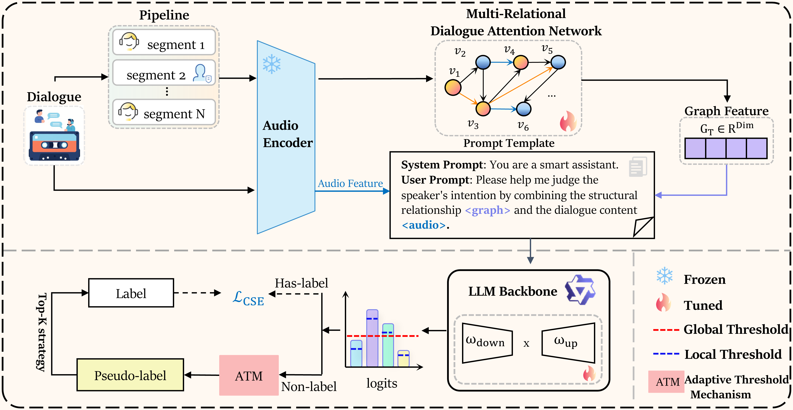
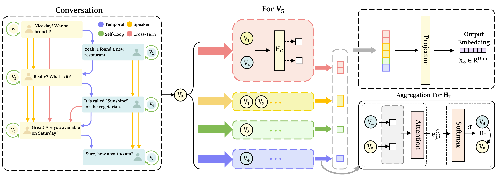

# DialogGraph-LLM: Multi-Relational Graph-Informed LLM for End-to-End Audio Dialogue Intent Recognition

<p align="center">
  <a href="https://david188888.github.io/Paper//ECAI-2025_paper_8221.pdf">📄 Paper</a> •
    <a href="#-quick-start">🚀 Quick Start</a> •
    <a href="#-results">📊 Results</a> •
</p>

<div align="center">

</div>

<div align="center">

**DialogGraph-LLM: A novel multimodal framework integrating Multi-Relational Dialogue Attention Network (MR-DAN) with Large Language Models for audio dialogue intent recognition.**

</div>

## 🔥 News

- **2025.07.10** - 🎉 Paper accepted to **ECAI 2025 (oral)**!
<!-- - **2025.08** - 📊 Released **MarketCalls** dataset with 8,770 real-world telemarketing conversations -->
- **2025.06.24** - 📝 Paper review scores: 7 (good, probably should be accepted), 8 (very good top 50% of all accepted papers at top AI conferences over the years), 6 (borderline (but tending towards acceptance), 7
- **2025.04** - 🚀 Code is publicly available

## ✨ Key Features

- **🎯 State-of-the-Art Performance**: Achieves **77.31%** accuracy on a private MarketCalls dataset and **70.91%** accuracy on the public MIntRec2.0 benchmark (IS+OS).
- **🕸️ Multi-Relational Graph Modeling（MR-DAN）**: Modeling dialogues as heterogeneous graphs. It captures complex inter-utterance dependencies using four distinct edge types: temporal, speaker, cross-turn semantic similarity, and self-loops. MR-DAN employs a specialized multi-head attention mechanism where distinct sets of attention heads are dedicated to processing each specific edge type, enabling nuanced aggregation of contextual information. 
- **🔄 Adaptive Semi-Supervised Learning**: Implements an innovative SSL strategy leveraging LLM-generated candidate predictions. This includes an **Adaptive Threshold Mechanism (ATM)** for dynamic, class-aware thresholding, a **Δ-Margin strategy** for robust high-confidence pseudo-label selection, and **Class-Balanced Top-K sampling** to effectively address class imbalance and augment training data.
- **🤖 LLM-Powered Reasoning**: Built upon the **Qwen2.5-Omni-7B** multimodal foundation model, integrating graph-derived structural semantics and direct audio features via prompt engineering for sophisticated intent recognition.
- **⚡ Efficient Architecture**: Parameter-efficient fine-tuning with **LoRA** for practical deployment

<!-- 
## 📋 Contents

- [🔥 News](#-news)
- [✨ Key Features](#-key-features)
- [🚀 Quick Start](#-quick-start)
- [📦 Installation](#-installation)
- [🏗️ Model Zoo](#️-model-zoo)
- [💻 Usage](#-usage)
  - [Basic Usage](#basic-usage)
  - [Training](#training)
  - [Evaluation](#evaluation)
  - [Advanced Configuration](#advanced-configuration)
- [📊 Results](#-results)
  - [Main Results](#main-results)
  - [Ablation Studies](#ablation-studies)
  - [Sensitivity Analysis](#sensitivity-analysis)
- [🔬 Method](#-method)
  - [Problem Formulation](#problem-formulation)
  - [Framework Architecture](#framework-architecture)
  - [Multi-Relational Dialogue Attention Network (MR-DAN)](#multi-relational-dialogue-attention-network-mr-dan)
  - [Adaptive Semi-Supervised Learning](#adaptive-semi-supervised-learning)
  - [Mathematical Formulation](#mathematical-formulation)
- [📁 Datasets](#-datasets)
- [🔧 Reproducibility](#-reproducibility)
- [🤝 Contributing](#-contributing)
- [📝 Citation](#-citation)
- [📄 License](#-license)
- [🙏 Acknowledgments](#-acknowledgments) -->

## 🔬 Method
### DialogGraph-LLM Framework Architecture

<div align="center">

<p><em>Figure 1: The DialogGraph-LLM framework integrating multimodal processing, graph-structured dialogue modeling via MR-DAN, and adaptive semi-supervised learning for robust intent recognition.</em></p>
</div>

---
### Multi-Relational Dialogue Attention Network (MR-DAN)

<div align="center">

<p><em>Figure 2: MR-DAN explicitly models multiple relationship types in dialogues through specialized attention mechanisms, enabling comprehensive structural understanding.</em></p>
</div>

---

## 🚀 Quick Start

### Installation

```bash
# Clone the repository
git clone git@github.com:david188888/DialogGraph-LLM.git
cd AudioLLM-Telemarketing

# Create and activate a virtual environment
conda create -n <env_name>
conda activate <env_name>

# Install dependencies
pip install -r requirements.txt
 
```

<!-- ## 🏗️ Model Zoo

We provide pre-trained models with different backbones and configurations:

| Model | Backbone | MarketCalls Acc | MIntRec2.0 Acc | Params | Download |
|-------|----------|-----------------|----------------|--------|----------|
| DialogGraph-LLM-Base | Qwen2.5-Omni-7B | 77.31% | 70.91% | 7.6B | [🤗 HF](https://huggingface.co/) |
| DialogGraph-LLM-Large | Qwen2.5-Omni-14B | 79.45% | 72.18% | 14.7B | [🤗 HF](https://huggingface.co/) |
| DialogGraph-LLM-Lite | Qwen2.5-3B | 74.22% | 68.35% | 3.1B | [🤗 HF](https://huggingface.co/) |

**Note**: All models use LoRA fine-tuning with rank=16, making them memory-efficient and fast to deploy. -->

## 💻 Usage

### Data Preparation
Before training, you need to prepare the datasets:
#### 1. MIntRec2.0 Dataset
Download the MIntRec2.0 dataset from the official repository:
```bash
# Clone the MIntRec2.0 repository
git clone https://github.com/thuiar/MIntRec2.0.git

# Create data directory and copy dataset
mkdir -p data
cp -r MIntRec2.0/data/* data/
```

Visit the [MIntRec2.0 repository](https://github.com/thuiar/MIntRec2.0) for detailed dataset information and preparation instructions.

#### 2. MarketCalls Dataset
The **MarketCalls** dataset is currently **not publicly available** as it requires privacy processing for user voice data. We are working on anonymizing the audio data while preserving the conversational patterns essential for intent recognition research.


### Training
```bash
# Train with MarketCalls dataset
python train.py \
    --config configs/marketcalls_ssl.yaml \
    --model_name_or_path Qwen/Qwen2.5-Omni-7B \
    --output_dir outputs/dialoggraph-marketcalls \
    --use_ssl \
    --ssl_start_epoch 10 \
    --lambda_ema 0.95 \
    --margin_tolerance 0.06
```
## 📊 Results

### Main Results

#### MarketCalls Dataset Performance

Our DialogGraph-LLM achieves significant improvements over strong LLM baselines on the MarketCalls dataset:

| Model | Overall Acc (%) | Overall F1 (%) | Class A F1 (%) | Class B F1 (%) | Class C F1 (%) | Class D F1 (%) |
|-------|-----------------|----------------|----------------|----------------|----------------|----------------|
| Llama3.1-8B | 49.85 | 49.20 | 22.70 | 56.10 | 58.50 | 19.30 |
| GLM-4-9B | 51.75 | 51.15 | 23.60 | 58.00 | 60.30 | 20.20 |
| Gemini1.5-Pro | 53.60 | 53.00 | 24.50 | 60.00 | 62.20 | 21.20 |
| Qwen2.5-Omni | 63.58 | 63.10 | 28.50 | 72.50 | 74.30 | 24.80 |
| **DialogGraph-LLM** | **77.31** | **76.83** | **44.53** | **83.54** | **85.21** | **41.75** |

**Key Improvements:**
- **+13.73%** accuracy improvement over Qwen2.5-Omni baseline
- **+20%** F1-score improvement in minority classes (A & D)
- Consistent gains across all intent categories

#### MIntRec2.0 Benchmark Results

Comparison with state-of-the-art multimodal intent recognition methods:

| Method | IS Acc (%) | IS F1 (%) | IS Precision (%) | IS Recall (%) | IS+OS Acc (%) | IS+OS F1 (%) |
|--------|------------|-----------|------------------|---------------|---------------|--------------|
| MulT (ACL 2019) | 60.66 | 54.12 | 58.02 | 53.77 | 56.00 | 47.35 |
| MAG-BERT (ACL 2020) | 60.58 | 55.17 | 57.78 | 55.10 | 56.20 | 48.00 |
| TCL-MAP (AAAI 2024) | 61.97 | 56.09 | 58.14 | 53.42 | - | - |
| A-MESS | 62.39 | 55.91 | 60.10 | 55.93 | 56.81 | 49.31 |
| **DialogGraph-LLM** | **70.91** | **66.54** | **69.12** | **64.15** | **64.28** | **58.14** |

**Achievements:**
- **+8.52%** accuracy improvement over previous SOTA
- **+10.63%** F1-score improvement  
- Strong performance on both in-scope and out-of-scope detection


## 🤝 Contributing
We welcome contributions from the community! Here's how you can help improve DialogGraph-LLM

## 🙏 Acknowledgments

We gratefully acknowledge the following contributions and support:

- **[Qwen2.5-Omni](https://github.com/QwenLM/Qwen2.5-Omni)**: This project builds upon the outstanding **Qwen2.5-Omni-7B** multimodal foundation model developed by the Qwen Team at Alibaba Cloud. Qwen2.5-Omni is an end-to-end multimodal model capable of perceiving diverse modalities including text, images, audio, and video while generating natural speech responses. The model is released under the [Apache-2.0 License](https://github.com/QwenLM/Qwen2.5-Omni/blob/main/LICENSE), and we extend our sincere gratitude to the Qwen team for making this powerful model available to the research community.

- **[MIntRec2.0](https://github.com/thuiar/MIntRec2.0)**: We acknowledge the use of the **MIntRec2.0** dataset, a large-scale benchmark for multimodal intent recognition and out-of-scope detection in multi-party conversations. This comprehensive dataset contains 15,040 utterances across 30 intent classes with text, video, and audio modalities, providing an essential resource for evaluating multimodal intent recognition approaches. The dataset is released under the [CC-BY-NC-SA-4.0 License](https://creativecommons.org/licenses/by-nc-sa/4.0/), and we are grateful to the authors for their valuable contribution to the multimodal intent recognition research community.
---


**🌟 Star us on GitHub if you find this project helpful! 🌟**
For questions, issues, or collaborations, please:
📧 **Email**: [hongyuliu@m.scnu.edu.cn](hongyuliu@m.scnu.edu.cn) or [junxinli@m.scnu.edu.cn](junxinli@m.scnu.edu.cn)
